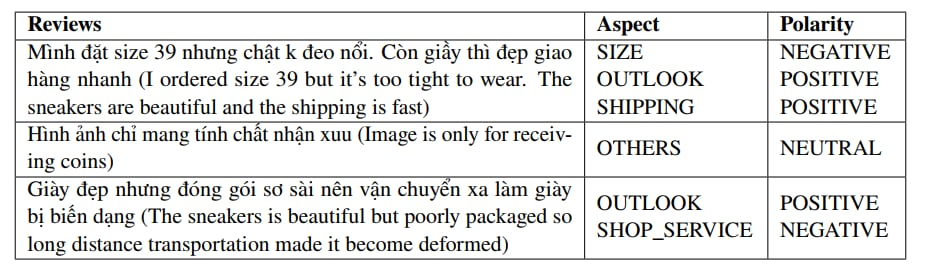
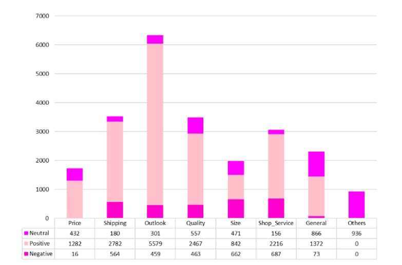
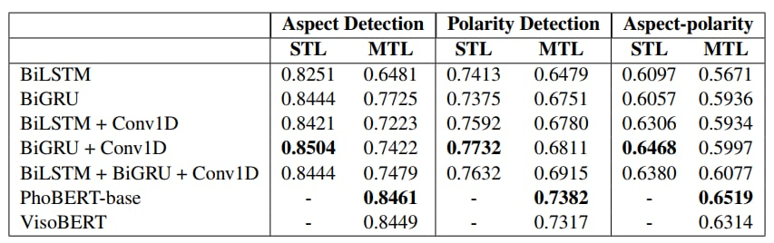

# Vietnamese Review Aspect-Based Sentiment Analysis

This repository contains a personal course project for aspect-based sentiment analysis on Shopee product reviews. The project compares single-task and multi-task learning approaches for classifying sentiment across multiple review aspects.

## Abstract

Nowadays, shopping on e-commerce platforms has become more and more popular and the review will help a lot for customers to make decisions. Much research has used machine learning to classify the sentiment of the review but traditional sentiment analysis can not detect the aspect of the product or service of the seller, they can not optimize and exploit the full value contained in the data. Lately, sentiment analysis has been upgraded to a new age with aspect base analysis that can detect the sentiment for each aspect of the product. In this paper, we present a handmade dataset with 11700 reviews on shopee. We also implement many Deep Learning models with two approachs: SingleTask Learning and Multi-Task Learning for this dataset to find out the efficiency of the dataset and models for two tasks: aspect detection and sentiment classification

## Dataset

Our dataset was crawled on Shopee about sneakers for aspect-based sentiment analysis tasks by using Selenium in Python. We choose Shopee because it is a popular e-commerce platform in Vietnam, it has more feedback than other platforms.

This dataset contains 11700 Vietnamese reviews and was annotated manually for 2 subtasks: aspect detection and sentiment classification. With our dataset, we design 8 aspects: PRICE, SHIPPING, OUTLOOK , QUALITY, SIZE, SHOP-SERVICES and GENERAL and 1 aspect to detect spam OTHERS, and their definition are shown in Table 1. For sentiment classification, we divided it into 3 labels: POSITIVE, NEGATIVE and NEUTRAL. We split data into 3 pieces in the ratio 7:2:1: training set with 8424 reviews, testing set with 2340 reviews, and validation set with 936 reviews.

<p align="center">
  
  <br>
  <em>Dataset Samples</em>
</p>

<p align="center">
  
  <br>
  <em>Aspect Sentiment Distribution</em>
</p>

## Method

**Single-task learning** is the process of learning to predict a single outcome (binary, multi-class, or continuous). According to (**Zhang et al., 2022**), there are 2 main subtasks in Aspect Based Sentiment Analysis: aspect category detection and aspect sentiment classification. Aspect category detection will detect the aspect and the output will be taken to a sentiment classification model where the will classify the sentiment of the review. To do this, we built 2 different models for each task.

**Multi-task learning** is the process of jointly learning to predict multiple outcomes on inputs of the same modality. For the Aspect Based Sentiment Analysis, the aspects and corresponding sentiment are predicted simultaneously. With multi-task, our approach is a deep learning model with the ability to multitask.

## Experiments

The notebooks cover the following experiments:

- Single-task learning with simple neural models.
- Multi-task learning with simple neural models, PhoBERT and VisoBERT.

<p align="center">
  
  <br>
  <em>Overall result</em>
</p>

## Repository Structure

```text
.
|-- Code/
|   |-- Multi-Task Learning PhoBERT.ipynb
|   |-- Multi-Task Learning Simple Models.ipynb
|   |-- Multi-Task Learning VisoBERT.ipynb
|   |-- Single-Task Learning Simple Models.ipynb
|   `-- preprocess.py
|-- Dataset/
|   |-- train_data.csv
|   |-- val_data.csv
|   `-- test_data.csv
|-- Doc/
|   `-- Img/
|       |-- Aspect-sentiment-distribution.jpg
|       |-- Dataset-samples.jpg
|       `-- Overall-result.jpg
|-- Reports/
|   |-- presentation.pptx
|   `-- report.pdf
|-- .gitattributes
|-- .gitignore
|-- README.md
`-- requirements.txt
```
